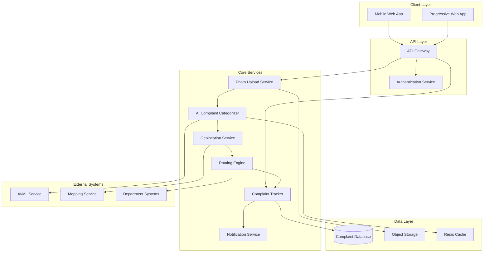

# Design Document: Smart City Complaint Categorizer

## Overview

The Smart City Complaint Categorizer is a mobile-first web application that enables citizens to report municipal issues through photo uploads. The system architecture follows a microservices pattern with clear separation between the client application, API gateway, core services, and external integrations.

The application flow is:
1. Citizen captures/selects a photo and submits complaint
2. Photo is uploaded to cloud storage
3. AI classification service analyzes the image
4. Geolocation service validates and enriches location data
5. Routing engine assigns complaint to appropriate department
6. Notification service confirms submission to citizen
7. Complaint tracker maintains status throughout lifecycle

The design prioritizes reliability, scalability, and user experience, with offline capability for areas with poor connectivity.

## Architecture

### System Components



### Technology Stack

**Client:**
- Progressive Web App (PWA) for offline capability
- React for UI components
- IndexedDB for local storage of draft complaints
- Service Workers for background sync

**Backend:**
- RESTful API architecture
- Node.js/Express for API Gateway
- Python for AI classification service
- PostgreSQL for complaint data
- Redis for caching classification results
- S3-compatible object storage for photos

**AI/ML:**
- Pre-trained image classification model (ResNet-50 or EfficientNet)
- Fine-tuned on municipal complaint dataset
- Confidence scoring for classification results

**Infrastructure:**
- Container-based deployment (Docker/Kubernetes)
- Horizontal scaling for upload and classification services
- Message queue (RabbitMQ) for async processing

## Components and Interfaces

### 1. Photo Upload Service

**Responsibilities:**
- Accept photo uploads from clients
- Validate file format and size
- Store photos in object storage
- Trigger classification pipeline

**Interface:**

```typescript
interface PhotoUploadService {
  uploadPhoto(photo: File, metadata: UploadMetadata): Promise<UploadResult>
  validatePhoto(photo: File): ValidationResult
  retryUpload(uploadId: string): Promise<UploadResult>
}

interface UploadMetadata {
  deviceId: string
  timestamp: Date
  coordinates?: GeoCoordinates
}

interface UploadResult {
  complaintId: string
  photoUrl: string
  status: 'success' | 'pending' | 'failed'
}

interface ValidationResult {
  isValid: boolean
  errors: string[]
}
```

**Validation Rules:**
- Accepted formats: JPEG, PNG, HEIC
- Maximum file size: 10MB
- Minimum resolution: 640x480 pixels

### 2. AI Complaint Categorizer

**Responsibilities:**
- Classify uploaded photos into complaint types
- Calculate confidence scores
- Flag low-confidence classifications for manual review
- Cache classification results

**Interface:**

```typescript
interface ComplaintCategorizer {
  classifyImage(photoUrl: string): Promise<ClassificationResult>
  getConfidenceThreshold(): number
  getSupportedTypes(): ComplaintType[]
}

interface ClassificationResult {
  complaintType: ComplaintType
  confidence: number
  alternativeTypes: Array<{type: ComplaintType, confidence: number}>
  requiresManualReview: boolean
}

enum ComplaintType {
  POTHOLE = 'pothole',
  GARBAGE = 'garbage',
  GRAFFITI = 'graffiti',
  BROKEN_STREETLIGHT = 'broken_streetlight',
  DAMAGED_SIGNAGE = 'damaged_signage',
  ILLEGAL_DUMPING = 'illegal_dumping'
}
```

**Classification Pipeline:**
1. Preprocess image (resize, normalize)
2. Run through classification model
3. Apply confidence threshold (70%)
4. Return primary classification and alternatives
5. Cache result with 24-hour TTL

### 3. Geolocation Service

**Responsibilities:**
- Capture GPS coordinates from device
- Validate coordinates within municipal boundaries
- Reverse geocode to human-readable address
- Handle manual address entry fallback

**Interface:**

```typescript
interface GeolocationService {
  captureLocation(deviceCoordinates?: GeoCoordinates): Promise<LocationResult>
  validateBoundaries(coordinates: GeoCoordinates): boolean
  reverseGeocode(coordinates: GeoCoordinates): Promise<Address>
  geocodeAddress(address: string): Promise<GeoCoordinates>
}

interface GeoCoordinates {
  latitude: number
  longitude: number
  accuracy: number
}

interface Address {
  street: string
  city: string
  postalCode: string
  formattedAddress: string
}

interface LocationResult {
  coordinates: GeoCoordinates
  address: Address
  isWithinBoundaries: boolean
}
```

**Boundary Validation:**
- Municipal boundary polygon stored in PostGIS
- Point-in-polygon check for coordinate validation
- Configurable boundary data per municipality

### 4. Routing Engine

**Responsibilities:**
- Map complaint types to municipal departments
- Create work orders in department systems
- Handle routing failures with retry logic
- Maintain department mapping configuration

**Interface:**

```typescript
interface RoutingEngine {
  routeComplaint(complaint: Complaint): Promise<RoutingResult>
  getDepartmentMapping(): Map<ComplaintType, Department>
  updateMapping(type: ComplaintType, department: Department): void
  retryFailedRouting(complaintId: string): Promise<RoutingResult>
}

interface Department {
  id: string
  name: string
  apiEndpoint: string
  isPrimary: boolean
}

interface RoutingResult {
  department: Department
  workOrderId: string
  status: 'routed' | 'queued' | 'failed'
}

interface Complaint {
  id: string
  type: ComplaintType
  photoUrl: string
  location: LocationResult
  timestamp: Date
  classification: ClassificationResult
}
```

**Routing Logic:**
- Lookup department by complaint type
- Call department API to create work order
- Retry up to 3 times with exponential backoff
- Queue for manual routing if all retries fail

### 5. Complaint Tracker

**Responsibilities:**
- Manage complaint lifecycle and status
- Store complaint history
- Provide query interface for status checks
- Track resolution metrics

**Interface:**

```typescript
interface ComplaintTracker {
  createComplaint(complaint: Complaint): Promise<string>
  updateStatus(complaintId: string, status: ComplaintStatus, metadata?: StatusMetadata): Promise<void>
  getComplaint(complaintId: string): Promise<ComplaintRecord>
  getStatusHistory(complaintId: string): Promise<StatusHistory[]>
  queryComplaints(filter: ComplaintFilter): Promise<ComplaintRecord[]>
}

enum ComplaintStatus {
  SUBMITTED = 'submitted',
  ASSIGNED = 'assigned',
  IN_PROGRESS = 'in_progress',
  RESOLVED = 'resolved',
  REJECTED = 'rejected'
}

interface StatusMetadata {
  notes?: string
  assignedTo?: string
  resolvedBy?: string
  resolutionDetails?: string
}

interface ComplaintRecord {
  id: string
  complaint: Complaint
  status: ComplaintStatus
  createdAt: Date
  updatedAt: Date
  assignedDepartment?: Department
  statusHistory: StatusHistory[]
}

interface StatusHistory {
  status: ComplaintStatus
  timestamp: Date
  metadata?: StatusMetadata
}

interface ComplaintFilter {
  type?: ComplaintType
  status?: ComplaintStatus
  dateFrom?: Date
  dateTo?: Date
  department?: string
}
```

### 6. Notification Service

**Responsibilities:**
- Send notifications to citizens
- Support multiple channels (push, email)
- Handle notification preferences
- Track delivery status

**Interface:**

```typescript
interface NotificationService {
  sendNotification(notification: Notification): Promise<DeliveryResult>
  sendBatch(notifications: Notification[]): Promise<DeliveryResult[]>
  getPreferences(citizenId: string): Promise<NotificationPreferences>
}

interface Notification {
  complaintId: string
  citizenContact: ContactInfo
  type: NotificationType
  message: string
  data?: Record<string, any>
}

enum NotificationType {
  CONFIRMATION = 'confirmation',
  STATUS_UPDATE = 'status_update',
  RESOLUTION = 'resolution'
}

interface ContactInfo {
  pushToken?: string
  email?: string
}

interface NotificationPreferences {
  pushEnabled: boolean
  emailEnabled: boolean
}

interface DeliveryResult {
  success: boolean
  channel: 'push' | 'email'
  error?: string
}
```

## Data Models

### Complaint Entity

```typescript
interface ComplaintEntity {
  // Primary identifiers
  id: string                          // UUID
  citizenDeviceId: string             // Anonymous device identifier
  
  // Photo data
  photoUrl: string                    // Object storage URL
  photoMetadata: {
    format: string
    sizeBytes: number
    dimensions: {width: number, height: number}
    capturedAt: Date
  }
  
  // Classification data
  classification: {
    type: ComplaintType
    confidence: number
    alternativeTypes: Array<{type: ComplaintType, confidence: number}>
    requiresManualReview: boolean
    classifiedAt: Date
  }
  
  // Location data
  location: {
    coordinates: {
      latitude: number
      longitude: number
      accuracy: number
    }
    address: {
      street: string
      city: string
      postalCode: string
      formattedAddress: string
    }
    isWithinBoundaries: boolean
  }
  
  // Routing data
  routing: {
    department: {
      id: string
      name: string
    }
    workOrderId: string
    routedAt: Date
  }
  
  // Status tracking
  status: ComplaintStatus
  statusHistory: Array<{
    status: ComplaintStatus
    timestamp: Date
    metadata?: StatusMetadata
  }>
  
  // Contact info (optional)
  citizenContact?: {
    email?: string
    pushToken?: string
  }
  
  // Timestamps
  createdAt: Date
  updatedAt: Date
  resolvedAt?: Date
}
```

### Department Mapping Configuration

```typescript
interface DepartmentMappingConfig {
  complaintType: ComplaintType
  departments: Array<{
    id: string
    name: string
    apiEndpoint: string
    isPrimary: boolean
    priority: number
  }>
  updatedAt: Date
  updatedBy: string
}
```

### Database Schema

**complaints table:**
- id (UUID, primary key)
- citizen_device_id (VARCHAR)
- photo_url (TEXT)
- photo_metadata (JSONB)
- classification (JSONB)
- location (JSONB with PostGIS geometry)
- routing (JSONB)
- status (VARCHAR)
- citizen_contact (JSONB, encrypted)
- created_at (TIMESTAMP)
- updated_at (TIMESTAMP)
- resolved_at (TIMESTAMP)

**status_history table:**
- id (UUID, primary key)
- complaint_id (UUID, foreign key)
- status (VARCHAR)
- metadata (JSONB)
- timestamp (TIMESTAMP)

**department_mappings table:**
- id (UUID, primary key)
- complaint_type (VARCHAR)
- departments (JSONB)
- updated_at (TIMESTAMP)
- updated_by (VARCHAR)

**Indexes:**
- complaints(status, created_at) - for dashboard queries
- complaints(citizen_device_id) - for citizen lookup
- complaints(location) - PostGIS spatial index
- status_history(complaint_id, timestamp) - for history queries


## Correctness Properties

*A property is a characteristic or behavior that should hold true across all valid executions of a system—essentially, a formal statement about what the system should do. Properties serve as the bridge between human-readable specifications and machine-verifiable correctness guarantees.*

### Property 1: Valid Photo Format Acceptance
*For any* file with format JPEG, PNG, or HEIC and size under 10MB, the Photo_Upload_Service should accept the upload and return a unique complaint identifier.

**Validates: Requirements 1.1, 1.2**

### Property 2: Upload Retry on Failure
*For any* photo upload that fails due to network issues, the Photo_Upload_Service should retry up to 3 times before returning a failure status.

**Validates: Requirements 1.4**

### Property 3: Unique Complaint Identifiers
*For any* set of successful photo uploads, all returned complaint identifiers should be unique.

**Validates: Requirements 1.5**

### Property 4: Classification Returns Valid Type
*For any* uploaded photo, the Complaint_Categorizer should return a classification that is one of the supported complaint types (pothole, garbage, graffiti, broken streetlight, damaged signage, illegal dumping).

**Validates: Requirements 2.1**

### Property 5: Low Confidence Flagging
*For any* classification result with confidence score below 70%, the complaint should be flagged for manual review.

**Validates: Requirements 2.3**

### Property 6: Single Primary Classification
*For any* photo, the Complaint_Categorizer should return exactly one primary complaint type, regardless of how many issues are present in the image.

**Validates: Requirements 2.4**

### Property 7: Classification Persistence Round-Trip
*For any* complaint, storing its classification and then retrieving the complaint should return the same classification data.

**Validates: Requirements 2.5**

### Property 8: Geolocation Data Completeness
*For any* submitted complaint with valid GPS coordinates, the stored complaint should contain both coordinates and a reverse-geocoded address.

**Validates: Requirements 3.1, 3.5**

### Property 9: Municipal Boundary Validation
*For any* set of GPS coordinates, the Geolocation_Service should correctly identify whether they fall within the configured municipal boundaries.

**Validates: Requirements 3.3**

### Property 10: Complaint Type to Department Mapping
*For any* classified complaint, the Routing_Engine should route it to a department that is configured to handle that complaint type.

**Validates: Requirements 4.1**

### Property 11: Primary Department Selection
*For any* complaint type with multiple assigned departments, the Routing_Engine should always route to the department marked as primary.

**Validates: Requirements 4.3**

### Property 12: Work Order Creation
*For any* successfully routed complaint, a work order should be created in the assigned department's system.

**Validates: Requirements 4.4**

### Property 13: Routing Failure Queuing
*For any* complaint where routing fails due to system unavailability, the complaint should be added to the retry queue and not lost.

**Validates: Requirements 4.5**

### Property 14: Status Lifecycle State Machine
*For any* complaint, its status transitions should follow the valid state machine: Submitted → Assigned → In Progress → Resolved, and each transition should be recorded in the status history.

**Validates: Requirements 5.1, 5.2, 5.3, 5.4**

### Property 15: Status Query Round-Trip
*For any* complaint that has undergone status updates, querying by complaint ID should return the current status and complete status history.

**Validates: Requirements 5.5**

### Property 16: Dashboard Data Completeness
*For any* complaint displayed in the dashboard, it should include status, type, location, and assigned department fields.

**Validates: Requirements 6.1**

### Property 17: Type Filter Correctness
*For any* complaint type filter applied to the dashboard, all returned complaints should match the selected type, and no complaints of that type should be excluded.

**Validates: Requirements 6.2**

### Property 18: Date Range Filter Correctness
*For any* date range filter applied to the dashboard, all returned complaints should have submission dates within the specified range.

**Validates: Requirements 6.3**

### Property 19: Complaint Detail View Completeness
*For any* complaint selected in the dashboard, the detail view should include photo, location, classification confidence, and complete status history.

**Validates: Requirements 6.4**

### Property 20: Reclassification Triggers Re-routing
*For any* complaint that is manually reclassified, the system should update the complaint type and route it to the department responsible for the new type.

**Validates: Requirements 6.5**

### Property 21: Status Change Notifications
*For any* complaint status change (submission, in progress, resolution), a notification should be sent to the citizen if contact information is provided.

**Validates: Requirements 7.1, 7.2, 7.3**

### Property 22: Notification Channel Selection
*For any* notification, the delivery channel (push or email) should match the citizen's notification preferences, with email as fallback when push is unavailable.

**Validates: Requirements 7.4, 7.5**

### Property 23: EXIF Metadata Stripping
*For any* uploaded photo with EXIF metadata, the stored photo should have all EXIF data removed except for geolocation information.

**Validates: Requirements 8.1**

### Property 24: PII Encryption at Rest
*For any* complaint with personally identifiable information (contact details), the stored data should be encrypted.

**Validates: Requirements 8.2**

### Property 25: Queue Behavior Under Load
*For any* request received when system capacity is exceeded, the request should be queued and the citizen should receive an expected processing time notification.

**Validates: Requirements 9.5**

### Property 26: Offline Draft Storage
*For any* complaint drafted without network connectivity, the draft should be stored locally on the device.

**Validates: Requirements 10.1, 10.2**

### Property 27: Automatic Sync on Reconnection
*For any* set of draft complaints stored locally, when connectivity is restored, all drafts should be uploaded in the order they were created.

**Validates: Requirements 10.3, 10.4**

### Property 28: Draft Persistence After Upload Failure
*For any* draft complaint whose upload fails, the draft should remain in local storage and be retried on the next connectivity check.

**Validates: Requirements 10.5**

## Error Handling

### Upload Errors

**File Validation Errors:**
- Invalid format: Return 400 with message "Unsupported file format. Please upload JPEG, PNG, or HEIC."
- File too large: Return 413 with message "File size exceeds 10MB limit."
- Corrupted file: Return 400 with message "Unable to process file. Please try a different photo."

**Network Errors:**
- Connection timeout: Retry with exponential backoff (1s, 2s, 4s)
- After 3 retries: Return 503 with message "Upload failed. Please check your connection and try again."
- Store draft locally for offline sync

### Classification Errors

**AI Service Errors:**
- Service unavailable: Queue for retry, return 202 with message "Classification in progress. Check back shortly."
- Invalid image: Return 400 with message "Unable to analyze image. Please upload a clearer photo."
- Timeout: Retry once, then flag for manual review

**Low Confidence:**
- Confidence < 70%: Flag for manual review, notify administrators
- Return classification with warning: "Classification requires verification."

### Geolocation Errors

**GPS Errors:**
- GPS unavailable: Prompt for manual address entry
- Invalid coordinates: Return 400 with message "Unable to determine location. Please enable location services."
- Outside boundaries: Return 400 with message "Location is outside service area."

**Geocoding Errors:**
- Reverse geocoding fails: Store coordinates only, retry geocoding asynchronously
- Manual address invalid: Return 400 with message "Unable to verify address. Please check and try again."

### Routing Errors

**Department System Errors:**
- API unavailable: Queue complaint for retry (up to 3 attempts with 5-minute intervals)
- Invalid work order response: Log error, flag for manual routing
- After all retries fail: Notify administrators, mark complaint as "Pending Manual Routing"

**Configuration Errors:**
- No department mapping: Flag for manual routing, notify administrators
- Multiple primary departments: Use first in priority order, log warning

### Tracking Errors

**Database Errors:**
- Write failure: Retry transaction up to 3 times
- Constraint violation: Return 409 with specific error message
- Connection loss: Queue operation for retry, return 503

**Query Errors:**
- Invalid complaint ID: Return 404 with message "Complaint not found."
- Malformed query: Return 400 with validation errors

### Notification Errors

**Delivery Failures:**
- Push token invalid: Fall back to email
- Email delivery fails: Retry up to 3 times, then log failure
- No contact info: Skip notification, log event

**Rate Limiting:**
- Too many notifications: Queue for batch delivery
- Respect citizen preferences for notification frequency

## Testing Strategy

### Dual Testing Approach

The testing strategy employs both unit tests and property-based tests to ensure comprehensive coverage:

**Unit Tests** focus on:
- Specific examples of correct behavior
- Edge cases (file size limits, boundary coordinates, empty inputs)
- Error conditions and error messages
- Integration points between components
- Mock external dependencies (AI service, department APIs, mapping service)

**Property-Based Tests** focus on:
- Universal properties that hold for all inputs
- Comprehensive input coverage through randomization
- State machine transitions
- Round-trip properties (upload-retrieve, classify-store-query)
- Invariants (uniqueness, data completeness, ordering)

### Property-Based Testing Configuration

**Framework Selection:**
- JavaScript/TypeScript: fast-check
- Python: Hypothesis

**Test Configuration:**
- Minimum 100 iterations per property test
- Each test tagged with: **Feature: smart-city-complaint-categorizer, Property {number}: {property_text}**
- Each correctness property implemented by a SINGLE property-based test

**Example Property Test Structure:**

```typescript
// Feature: smart-city-complaint-categorizer, Property 1: Valid Photo Format Acceptance
test('valid photos are accepted and return unique IDs', async () => {
  await fc.assert(
    fc.asyncProperty(
      fc.record({
        format: fc.constantFrom('jpeg', 'png', 'heic'),
        size: fc.integer({min: 1, max: 10 * 1024 * 1024}),
        content: fc.uint8Array({minLength: 100, maxLength: 1000})
      }),
      async (photoData) => {
        const result = await uploadService.uploadPhoto(photoData);
        expect(result.status).toBe('success');
        expect(result.complaintId).toBeDefined();
        expect(result.complaintId).toMatch(/^[0-9a-f-]{36}$/); // UUID format
      }
    ),
    {numRuns: 100}
  );
});
```

### Test Coverage Requirements

**Component-Level Tests:**
- Photo Upload Service: 90%+ coverage
- AI Complaint Categorizer: 85%+ coverage (excluding ML model internals)
- Geolocation Service: 90%+ coverage
- Routing Engine: 90%+ coverage
- Complaint Tracker: 95%+ coverage
- Notification Service: 85%+ coverage

**Integration Tests:**
- End-to-end complaint submission flow
- Status update propagation
- Notification delivery
- Offline sync behavior
- Dashboard query performance

**Property Tests:**
- All 28 correctness properties implemented
- Each property test runs minimum 100 iterations
- Property tests run in CI/CD pipeline

### Test Data Generation

**Generators for Property Tests:**
- Valid photo files (various formats, sizes, resolutions)
- GPS coordinates (within and outside boundaries)
- Complaint types and classifications
- Status transitions
- Department configurations
- Notification preferences
- Network failure scenarios

**Mock Services:**
- AI classification service with configurable confidence scores
- Department APIs with success/failure modes
- Mapping service for geocoding
- Push notification service
- Email delivery service

### Performance Testing

While not part of unit/property tests, performance testing should validate:
- Upload latency under various network conditions
- Classification throughput (images per second)
- Database query performance with large datasets
- Concurrent user load (100+ simultaneous uploads)
- Offline sync performance with multiple queued complaints

### Security Testing

- Penetration testing for API endpoints
- EXIF metadata stripping verification
- Encryption at rest validation
- TLS configuration verification
- Input sanitization and SQL injection prevention
- Rate limiting and DDoS protection

### Monitoring and Observability

**Metrics to Track:**
- Upload success/failure rates
- Classification accuracy and confidence distribution
- Routing success rates
- Average time to resolution by complaint type
- Notification delivery rates
- System performance (latency, throughput)

**Logging:**
- Structured logging for all operations
- Error tracking with stack traces
- Audit trail for status changes
- Performance metrics for slow operations

**Alerts:**
- Upload failure rate > 5%
- Classification service unavailable
- Routing failures requiring manual intervention
- Database connection issues
- High queue depth (> 100 pending complaints)
